# Ethiopidia Database ER Diagram

This document visualizes the PostgreSQL schema defined in [`database/schema.sql`](../database/schema.sql). The diagram covers all 31 tables; the SQL file remains the source of truth for columns, constraints, and indexes.

```mermaid
erDiagram
    USERS {
        uuid id PK
    }
    DESTINATIONS {
        uuid id PK
    }
    DESTINATION_GUIDE_SECTIONS {
        uuid id PK
        uuid destination_id FK
    }
    DESTINATION_GALLERY {
        uuid id PK
        uuid destination_id FK
    }
    AMENITIES {
        uuid id PK
    }
    HOTELS {
        uuid id PK
        uuid destination_id FK
        uuid owner_user_id FK
    }
    HOTEL_AMENITIES {
        uuid hotel_id PK,FK
        uuid amenity_id PK,FK
    }
    HOTEL_PHOTOS {
        uuid id PK
        uuid hotel_id FK
    }
    HOTEL_POLICIES {
        uuid hotel_id PK,FK
    }
    ROOM_FEATURES {
        uuid id PK
    }
    ROOM_TYPES {
        uuid id PK
        uuid hotel_id FK
    }
    ROOM_TYPE_FEATURES {
        uuid room_type_id PK,FK
        uuid room_feature_id PK,FK
    }
    REVIEWS {
        uuid id PK
        uuid hotel_id FK
        uuid user_id FK
    }
    EXPERIENCES {
        uuid id PK
        uuid destination_id FK
    }
    EXPERIENCE_GALLERY {
        uuid id PK
        uuid experience_id FK
    }
    EXPERIENCE_MENU_ITEMS {
        uuid id PK
        uuid experience_id FK
    }
    EXPERIENCE_SERVICES {
        uuid id PK
        uuid experience_id FK
    }
    EXPERIENCE_SCHEDULE {
        uuid id PK
        uuid experience_id FK
    }
    INTERESTS {
        uuid id PK
    }
    INTEREST_DESTINATIONS {
        uuid interest_id PK,FK
        uuid destination_id PK,FK
    }
    INTEREST_EXPERIENCE_CATEGORIES {
        uuid interest_id PK,FK
        varchar category PK
    }
    INTEREST_HIGHLIGHT_SECTIONS {
        uuid id PK
        uuid interest_id FK
    }
    INTEREST_HIGHLIGHT_ITEMS {
        uuid id PK
        uuid section_id FK
        uuid experience_id FK
        uuid destination_id FK
    }
    LOCAL_FLAVOR_SECTIONS {
        uuid id PK
        uuid interest_id FK
    }
    LOCAL_FLAVOR_MOMENTS {
        uuid id PK
        uuid section_id FK
        uuid experience_id FK
        uuid destination_id FK
    }
    PROMOTIONS {
        uuid id PK
        uuid destination_id FK
    }
    FAVORITES {
        uuid user_id PK,FK
        uuid hotel_id PK,FK
    }
    VIEWED_HISTORY {
        uuid user_id PK,FK
        uuid hotel_id PK,FK
    }
    PROPERTY_LISTING_REQUESTS {
        uuid id PK
        uuid assigned_to FK
    }
    PROPERTY_LISTING_MEDIA {
        uuid id PK
        uuid request_id FK
    }
    CONTACT_MESSAGES {
        uuid id PK
        uuid assigned_to FK
    }

    USERS o|--o{ HOTELS : owns
    USERS o|--o{ REVIEWS : writes
    USERS ||--o{ FAVORITES : saves
    USERS ||--o{ VIEWED_HISTORY : views
    USERS o|--o{ PROPERTY_LISTING_REQUESTS : assigned
    USERS o|--o{ CONTACT_MESSAGES : assigned

    DESTINATIONS ||--o{ DESTINATION_GUIDE_SECTIONS : contains
    DESTINATIONS ||--o{ DESTINATION_GALLERY : contains
    DESTINATIONS ||--o{ HOTELS : has
    DESTINATIONS ||--o{ EXPERIENCES : has
    DESTINATIONS ||--o{ PROMOTIONS : promotes
    DESTINATIONS ||--o{ INTEREST_DESTINATIONS : tagged
    DESTINATIONS o|--o{ INTEREST_HIGHLIGHT_ITEMS : targets
    DESTINATIONS o|--o{ LOCAL_FLAVOR_MOMENTS : targets

    HOTELS ||--o{ HOTEL_AMENITIES : offers
    AMENITIES ||--o{ HOTEL_AMENITIES : assigned
    HOTELS ||--o{ HOTEL_PHOTOS : displays
    HOTELS ||--o| HOTEL_POLICIES : defines
    HOTELS ||--o{ ROOM_TYPES : provides
    HOTELS ||--o{ REVIEWS : receives
    HOTELS ||--o{ FAVORITES : saved_in
    HOTELS ||--o{ VIEWED_HISTORY : viewed_in

    ROOM_TYPES ||--o{ ROOM_TYPE_FEATURES : includes
    ROOM_FEATURES ||--o{ ROOM_TYPE_FEATURES : assigned

    EXPERIENCES ||--o{ EXPERIENCE_GALLERY : displays
    EXPERIENCES ||--o{ EXPERIENCE_MENU_ITEMS : offers
    EXPERIENCES ||--o{ EXPERIENCE_SERVICES : offers
    EXPERIENCES ||--o{ EXPERIENCE_SCHEDULE : schedules
    EXPERIENCES o|--o{ INTEREST_HIGHLIGHT_ITEMS : targets
    EXPERIENCES o|--o{ LOCAL_FLAVOR_MOMENTS : targets

    INTERESTS ||--o{ INTEREST_DESTINATIONS : includes
    INTERESTS ||--o{ INTEREST_EXPERIENCE_CATEGORIES : filters
    INTERESTS ||--o{ INTEREST_HIGHLIGHT_SECTIONS : contains
    INTERESTS ||--o| LOCAL_FLAVOR_SECTIONS : contains
    INTEREST_HIGHLIGHT_SECTIONS ||--o{ INTEREST_HIGHLIGHT_ITEMS : contains
    LOCAL_FLAVOR_SECTIONS ||--o{ LOCAL_FLAVOR_MOMENTS : contains

    PROPERTY_LISTING_REQUESTS ||--o{ PROPERTY_LISTING_MEDIA : uploads
```

## Cardinality legend

| Symbol | Meaning |
|---|---|
| `||` | Exactly one |
| `o|` | Zero or one |
| `o{` | Zero or many |

`PK` marks a primary key and `FK` marks a foreign key. Fields marked `PK,FK` are columns in a composite primary key that also reference another table.

## Related files

- [Database design and module documentation](database-schema.md)
- [Executable PostgreSQL schema](../database/schema.sql)
