# Ethiopidia Database Design

## 1. Purpose

This document defines a PostgreSQL database for Ethiopidia. It replaces the current mock TypeScript data and browser-only `localStorage` with persistent storage while preserving the existing product behavior.

The executable schema is in [`database/schema.sql`](../database/schema.sql).

## 2. Assumptions

- Database: PostgreSQL 15 or newer.
- Primary keys: UUID v4 values generated by PostgreSQL through `pgcrypto`.
- Languages: English (`en`) and Amharic (`am`). User-facing content stores one column per language, such as `title_en` and `title_am`.
- Currency: Ethiopian birr. Monetary columns use `NUMERIC(12, 2)` and the `_etb` suffix.
- Ethiopidia is a discovery marketplace. It does not store inventory, reservations, carts, or payments. A hotel or experience can link to an external booking website.
- Authentication passwords are stored only as strong hashes (Argon2id is recommended), never as plaintext.
- Images and videos are stored in object storage. The database stores their URLs and metadata.

## 3. Module and table map

| Module | Tables | Responsibility |
|---|---|---|
| Accounts | `users` | Traveler, owner, editor, and administrator identities |
| Destinations | `destinations`, `destination_guide_sections`, `destination_gallery` | Destination pages and bilingual guide content |
| Hotels | `hotels`, `hotel_photos`, `hotel_policies` | Property listing and external booking details |
| Amenities and rooms | `amenities`, `hotel_amenities`, `room_types`, `room_features`, `room_type_features` | Searchable amenities and room information |
| Reviews | `reviews` | Moderated hotel reviews |
| Experiences | `experiences`, `experience_gallery`, `experience_menu_items`, `experience_services`, `experience_schedule` | Activities, dining, wellness, nightlife, and external booking |
| Interests | `interests`, `interest_destinations`, `interest_experience_categories`, `interest_highlight_sections`, `interest_highlight_items`, `local_flavor_sections`, `local_flavor_moments` | Editorial interest landing pages |
| Promotions | `promotions` | Time-limited destination campaigns |
| Traveler activity | `favorites`, `viewed_history` | Saved hotels and recently viewed hotels |
| Property onboarding | `property_listing_requests`, `property_listing_media` | “List your property” submissions and uploaded media |
| Support | `contact_messages` | Contact form messages and staff workflow |

## 4. Relationship overview

The diagram is also available as a dedicated document: [Ethiopidia Database ER Diagram](database-er-diagram.md).

The following Mermaid ER diagram represents every table in `database/schema.sql`. Entities show primary and foreign keys; the SQL schema remains the source of truth for all other columns and constraints.

```mermaid
erDiagram
    USERS {
        uuid id PK
    }
    DESTINATIONS {
        uuid id PK
    }
    DESTINATION_GUIDE_SECTIONS {
        uuid id PK
        uuid destination_id FK
    }
    DESTINATION_GALLERY {
        uuid id PK
        uuid destination_id FK
    }
    AMENITIES {
        uuid id PK
    }
    HOTELS {
        uuid id PK
        uuid destination_id FK
        uuid owner_user_id FK
    }
    HOTEL_AMENITIES {
        uuid hotel_id PK,FK
        uuid amenity_id PK,FK
    }
    HOTEL_PHOTOS {
        uuid id PK
        uuid hotel_id FK
    }
    HOTEL_POLICIES {
        uuid hotel_id PK,FK
    }
    ROOM_FEATURES {
        uuid id PK
    }
    ROOM_TYPES {
        uuid id PK
        uuid hotel_id FK
    }
    ROOM_TYPE_FEATURES {
        uuid room_type_id PK,FK
        uuid room_feature_id PK,FK
    }
    REVIEWS {
        uuid id PK
        uuid hotel_id FK
        uuid user_id FK
    }
    EXPERIENCES {
        uuid id PK
        uuid destination_id FK
    }
    EXPERIENCE_GALLERY {
        uuid id PK
        uuid experience_id FK
    }
    EXPERIENCE_MENU_ITEMS {
        uuid id PK
        uuid experience_id FK
    }
    EXPERIENCE_SERVICES {
        uuid id PK
        uuid experience_id FK
    }
    EXPERIENCE_SCHEDULE {
        uuid id PK
        uuid experience_id FK
    }
    INTERESTS {
        uuid id PK
    }
    INTEREST_DESTINATIONS {
        uuid interest_id PK,FK
        uuid destination_id PK,FK
    }
    INTEREST_EXPERIENCE_CATEGORIES {
        uuid interest_id PK,FK
        varchar category PK
    }
    INTEREST_HIGHLIGHT_SECTIONS {
        uuid id PK
        uuid interest_id FK
    }
    INTEREST_HIGHLIGHT_ITEMS {
        uuid id PK
        uuid section_id FK
        uuid experience_id FK
        uuid destination_id FK
    }
    LOCAL_FLAVOR_SECTIONS {
        uuid id PK
        uuid interest_id FK
    }
    LOCAL_FLAVOR_MOMENTS {
        uuid id PK
        uuid section_id FK
        uuid experience_id FK
        uuid destination_id FK
    }
    PROMOTIONS {
        uuid id PK
        uuid destination_id FK
    }
    FAVORITES {
        uuid user_id PK,FK
        uuid hotel_id PK,FK
    }
    VIEWED_HISTORY {
        uuid user_id PK,FK
        uuid hotel_id PK,FK
    }
    PROPERTY_LISTING_REQUESTS {
        uuid id PK
        uuid assigned_to FK
    }
    PROPERTY_LISTING_MEDIA {
        uuid id PK
        uuid request_id FK
    }
    CONTACT_MESSAGES {
        uuid id PK
        uuid assigned_to FK
    }

    USERS o|--o{ HOTELS : owns
    USERS o|--o{ REVIEWS : writes
    USERS ||--o{ FAVORITES : saves
    USERS ||--o{ VIEWED_HISTORY : views
    USERS o|--o{ PROPERTY_LISTING_REQUESTS : assigned
    USERS o|--o{ CONTACT_MESSAGES : assigned

    DESTINATIONS ||--o{ DESTINATION_GUIDE_SECTIONS : contains
    DESTINATIONS ||--o{ DESTINATION_GALLERY : contains
    DESTINATIONS ||--o{ HOTELS : has
    DESTINATIONS ||--o{ EXPERIENCES : has
    DESTINATIONS ||--o{ PROMOTIONS : promotes
    DESTINATIONS ||--o{ INTEREST_DESTINATIONS : tagged
    DESTINATIONS o|--o{ INTEREST_HIGHLIGHT_ITEMS : targets
    DESTINATIONS o|--o{ LOCAL_FLAVOR_MOMENTS : targets

    HOTELS ||--o{ HOTEL_AMENITIES : offers
    AMENITIES ||--o{ HOTEL_AMENITIES : assigned
    HOTELS ||--o{ HOTEL_PHOTOS : displays
    HOTELS ||--o| HOTEL_POLICIES : defines
    HOTELS ||--o{ ROOM_TYPES : provides
    HOTELS ||--o{ REVIEWS : receives
    HOTELS ||--o{ FAVORITES : saved_in
    HOTELS ||--o{ VIEWED_HISTORY : viewed_in

    ROOM_TYPES ||--o{ ROOM_TYPE_FEATURES : includes
    ROOM_FEATURES ||--o{ ROOM_TYPE_FEATURES : assigned

    EXPERIENCES ||--o{ EXPERIENCE_GALLERY : displays
    EXPERIENCES ||--o{ EXPERIENCE_MENU_ITEMS : offers
    EXPERIENCES ||--o{ EXPERIENCE_SERVICES : offers
    EXPERIENCES ||--o{ EXPERIENCE_SCHEDULE : schedules
    EXPERIENCES o|--o{ INTEREST_HIGHLIGHT_ITEMS : targets
    EXPERIENCES o|--o{ LOCAL_FLAVOR_MOMENTS : targets

    INTERESTS ||--o{ INTEREST_DESTINATIONS : includes
    INTERESTS ||--o{ INTEREST_EXPERIENCE_CATEGORIES : filters
    INTERESTS ||--o{ INTEREST_HIGHLIGHT_SECTIONS : contains
    INTERESTS ||--o| LOCAL_FLAVOR_SECTIONS : contains
    INTEREST_HIGHLIGHT_SECTIONS ||--o{ INTEREST_HIGHLIGHT_ITEMS : contains
    LOCAL_FLAVOR_SECTIONS ||--o{ LOCAL_FLAVOR_MOMENTS : contains

    PROPERTY_LISTING_REQUESTS ||--o{ PROPERTY_LISTING_MEDIA : uploads
```



Cardinality symbols: `||` means exactly one, `o|` means zero or one, and `o{` means zero or many. Join tables implement the many-to-many relationships.

## 5. Important design decisions

### Bilingual content

English and Amharic values use explicit columns. This matches the current `Localized` TypeScript type and makes required translations enforceable with `NOT NULL`. If more languages are added later, migrate localized content to translation tables rather than adding many more language columns.

### Ratings

- `hotels.star_rating`: official property class from 1 to 5.
- `reviews.rating`: traveler score from 1 to 5.
- `hotels.guest_rating`: cached marketplace display score from 0 to 10.

The API should recalculate `guest_rating` from published reviews whenever review moderation changes. Review count should be calculated with `COUNT(*)`; it is deliberately not duplicated on `hotels` in the first version.

### External booking

`booking_active` or `bookable` can only be true when both the external URL and external site name exist. This is enforced by database checks. The database does not contain booking or payment tables because the current marketplace redirects users to partners.

### Content workflow

Public editorial records use `draft`, `published`, or `archived`. Public API queries must always filter for `status = 'published'`.

### Deletion behavior

- Child content such as photos and room types is deleted with its parent.
- A destination cannot be deleted while a hotel or experience references it.
- Deleting a user removes their favorites/history but preserves authored reviews and staff work assignments by setting those user references to `NULL`.

## 6. Main table notes

### `users`

Stores login identity and authorization role. Normalize emails with `LOWER(TRIM(email))` before insertion. The unique index is case-insensitive.

### `hotels`

The central searchable property record. Search filters map directly to `destination_id`, `property_type`, `star_rating`, `guest_rating`, `price_from_etb`, and `hotel_amenities`.

The existing UI’s `premium`, `featured`, and `new` badges map to boolean flags because these three badges have distinct product behavior. If badges become administrator-defined, replace them with `badges` and `hotel_badges` tables.

### `room_types`

Represents the room categories displayed on a hotel page. It is descriptive, not inventory. `active = false` hides an old room type without losing historical content.

### `reviews`

Reviews require moderation. Only `published` rows appear publicly. `author_name` remains even if the associated user is deleted.

### `property_listing_requests`

Matches the fields on `/for-hotels/get-started`. The selected service and amenity labels are stored as arrays because this table is an intake snapshot, not a live hotel listing. After approval, staff creates normalized `hotels` and `hotel_amenities` records.

### `favorites` and `viewed_history`

Composite primary keys prevent duplicates. Viewing a hotel again should perform an upsert that updates `viewed_at`.

## 7. Common API query patterns

### Search published hotels

```sql
SELECT h.*
FROM hotels h
WHERE h.status = 'published'
  AND ($1::uuid IS NULL OR h.destination_id = $1)
  AND ($2::numeric IS NULL OR h.price_from_etb >= $2)
  AND ($3::numeric IS NULL OR h.price_from_etb <= $3)
ORDER BY h.is_featured DESC, h.guest_rating DESC NULLS LAST
LIMIT $4 OFFSET $5;
```

### Filter by all selected amenities

```sql
SELECT h.*
FROM hotels h
JOIN hotel_amenities ha ON ha.hotel_id = h.id
JOIN amenities a ON a.id = ha.amenity_id
WHERE h.status = 'published'
  AND a.code = ANY($1::text[])
GROUP BY h.id
HAVING COUNT(DISTINCT a.code) = CARDINALITY($1::text[]);
```

### Save or refresh viewed history

```sql
INSERT INTO viewed_history (user_id, hotel_id)
VALUES ($1, $2)
ON CONFLICT (user_id, hotel_id)
DO UPDATE SET viewed_at = NOW();
```

## 8. Security and privacy requirements

- Use parameterized queries or a safe ORM; never concatenate user input into SQL.
- Hash passwords with Argon2id and an application-level password policy.
- Restrict direct database access to the API service and migration role.
- Do not expose `password_hash`, internal notes, contact messages, or property request data through public endpoints.
- Rate-limit authentication, contact, review, and property-request endpoints.
- Validate file type and size before uploading listing media; store files outside PostgreSQL.
- Record consent time for property listing submissions.
- Define a retention policy for rejected requests and resolved contact messages.
- Back up the database and test restoration regularly.

## 9. Recommended API modules

```text
modules/
  auth/
  users/
  destinations/
  hotels/
  amenities/
  rooms/
  reviews/
  experiences/
  interests/
  promotions/
  favorites/
  history/
  listing-requests/
  contact/
```

Each module should own validation, authorization, database queries, and response mapping for its tables. Route handlers should call module services instead of querying the database directly.

## 10. Applying the schema

Create an empty database, then run:

```bash
psql "$DATABASE_URL" -v ON_ERROR_STOP=1 -f database/schema.sql
```

The file uses a transaction, so a schema error rolls back the full installation.

## 11. Migration path from the current prototype

1. Provision PostgreSQL and store `DATABASE_URL` only in server-side environment variables.
2. Apply `database/schema.sql` through a migration tool.
3. Write a seed script that imports `data/destinations.ts`, `data/amenities.ts`, `data/hotels.ts`, `data/experiences.ts`, `data/interests.ts`, and `data/promotions.ts` in dependency order.
4. Add server API modules and replace direct imports from `data/*` with API/database calls.
5. Replace mock authentication with secure sessions.
6. Migrate favorites and viewed history from `localStorage` after a user signs in.
7. Connect contact and property-listing forms to protected server endpoints.
8. Add automated migration, constraint, authorization, and query tests before production release.

This schema is the persistence foundation; it does not by itself connect the existing Next.js pages to PostgreSQL.
